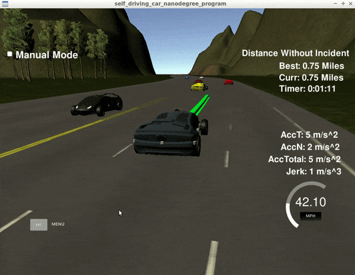
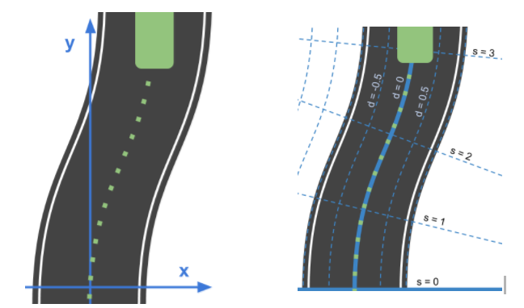

# CarND-Path-Planning-Project
This is the path planning project associated with the Udacity Self Driving Car Engineer Nanodegree program.

### Goals
The goal of this project is to implement Path Planning and Behavior Planning algorithms to safely navigate around a highway in a virtual simulation. One of the challenges of this simulation is that it includes other cars on the highway, which drive at varying speeds and change lanes. There is also a imposed speed limit of 22.35 meters/sec (50 MPH) which is not to be exceeded, and any jerk from the car suddenly accelerating should be minimized (should not exceed acceleration over 10 meters/sec^2, or jerk over 10 meters/sec^3). A map of the highway is provided in the from of a csv file which contains the x and y position of the highway which it wants to navigate to. It also converts these coordinates to the s and d coordinate system for classifying position on a road. The highway is 6946 meters (~4.32 miles) long.



### Highway Map
The map of the highway is a csv file in data/highway_map.txt. Each waypoint in the list contains  [x,y,s,dx,dy] values. x and y are the waypoint's map coordinate position, the s value is the distance along the road to get to that waypoint in meters, the dx and dy values define the unit normal vector pointing outward of the highway loop.

The highway's waypoints loop around so the frenet s value, distance along the road, goes from 0 to 6945.554.

## Approach

| Input | Description  |
|:-:|-|
| x,y  | Car's current x,y position (relative to map)  |
| yaw  | Car's current heading (relative to map)  |
| speed  | Car's current speed (in MPH)  |
| s,d  | Car's current s,d position (relative to road)  |
| sensor_fusion  | 2D vector of nearby cars (x,y,Vx,Vy,s,d)  |

| Output | Description  |
|:-:|-|
| next_x_vals  | List of x coordinates to pass the simulator for the car to traverse  |
| next_y_vals  | List of y coordinates to pass the simulator for the car to traverse  |


### Behavior Planning
There are a couple things to make sure our autonomous car considers when driving on the highway. For instance, we want to ensure our car is following the speed limit, is driving safely, stays in its own lane (unless changing lanes), and change lanes if the car in front is driving much below the speed limit. The value for each of these attributes are different, such that safety and legality is of most importance. We can rate the value of each action at any given time using the input data and putting it through a cost function, to deem what action generates the best outcome for the given situation.  

##### Cost Functions
| Attribute | Cost Determination  |
|:-:|-|
| Speed  | Cost increases if going too slow, or too fast (relative to speed limit), also depends on speed of car in front |
| Staying in Lane | Cost increases if we are not centered in our lane, this is attributed in the simulation by using the map coordinates to find the middle of the lane and pass it to our trajectory generator |
| Changing Lane | Cost decreases if car in front is going slow, goal distance is far, and lane to merge in is clear. Broken up into individual left and right turn cost |


### Trajectory Generation

##### Frenet Coordinates
For this project, we are given a known map with the x and y coordinate locations of the road. Even better, the map also translates those x and y coordinates into Frenet, s and d, coordinates. The s coordinate symbolizes the length of road which you are traveling along, while the d coordinate keeps track of the distance with respect to the center lane line. This simplifies classifying the position of the car with respect to the road, rather than some arbitrary x,y map coordinates.



Image above sourced from the Udacity Self Driving Car Engineer classroom.

##### Jerk Minimization

Being that self driving cars are usually encompassing human passengers, we want to ensure they are comfortable whenever the car changes position or speed. Essentially we want to minimize the change in acceleration, which is known as jerk. Sudden accelerations cause high jerk, which can cause discomfort for the passenger. To ensure jerk is minimized along our generated trajectory, two things are done. The first is ensuring the car does not accelerate (or decelerate) too fast. The second is to incorporate a "smooth", continuous path of points which make up our trajectory. This smooth path is achieved in this project by generating a spline (aka, a smoothly interpolated line). This prevents sudden changes in the car's yaw position when changing lanes or if the road curves.

## Other Background Information:

### Simulator.
You can download the Term3 Simulator which contains the Path Planning Project from the [releases tab](https://github.com/udacity/self-driving-car-sim/releases/tag/T3_v1.2).  

To run the simulator on Mac/Linux, first make the binary file executable with the following command:
```shell
sudo chmod u+x {simulator_file_name}
```

## Basic Build Instructions

1. Clone this repo.
2. Make a build directory: `mkdir build && cd build`
3. Compile: `cmake .. && make`
4. Run it: `./path_planning`.

---

## Dependencies

* cmake >= 3.5
  * All OSes: [click here for installation instructions](https://cmake.org/install/)
* make >= 4.1
  * Linux: make is installed by default on most Linux distros
  * Mac: [install Xcode command line tools to get make](https://developer.apple.com/xcode/features/)
  * Windows: [Click here for installation instructions](http://gnuwin32.sourceforge.net/packages/make.htm)
* gcc/g++ >= 5.4
  * Linux: gcc / g++ is installed by default on most Linux distros
  * Mac: same deal as make - [install Xcode command line tools]((https://developer.apple.com/xcode/features/)
  * Windows: recommend using [MinGW](http://www.mingw.org/)
* [uWebSockets](https://github.com/uWebSockets/uWebSockets)
  * Run either `install-mac.sh` or `install-ubuntu.sh`.
  * If you install from source, checkout to commit `e94b6e1`, i.e.
    ```
    git clone https://github.com/uWebSockets/uWebSockets
    cd uWebSockets
    git checkout e94b6e1
    ```
